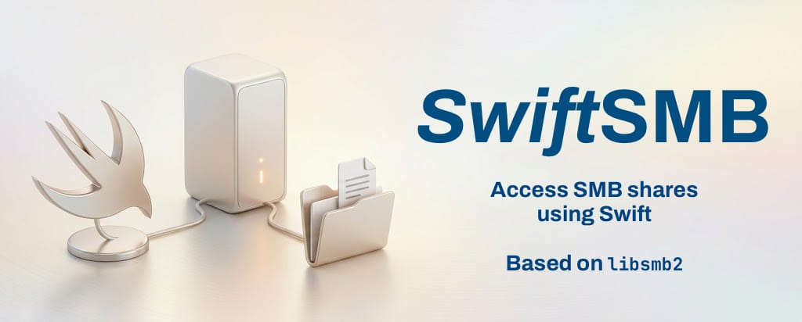

# SwiftSMB

[](LICENSE)

[](Package.swift)
[](Package.swift)
[](Package.swift)
[](Package.swift)
[](Package.swift)
[](Package.swift)
[](LinuxBuild/build.sh)
[](.github/workflows/android.yml)

[](https://swift.org/package-manager/)
[](https://github.com/RuiNelson/SwiftSMB/releases)
[](https://github.com/RuiNelson/SwiftSMB/actions/workflows/apple.yml)
[](https://github.com/RuiNelson/SwiftSMB/actions/workflows/linux.yml)
[](https://github.com/RuiNelson/SwiftSMB/actions/workflows/android.yml)



SwiftSMB is a Swift Package Manager library for talking to SMB2 and SMB3 file shares from Swift. It wraps the proven [`libsmb2`](https://github.com/sahlberg/libsmb2) client library in a Swift-first API with typed configuration, friendly path handling, file and directory handles, share discovery, metadata operations, and convenience helpers for common upload and download workflows.

Use it when your app or service needs to browse Windows, Samba, NAS, or other SMB-compatible shares without shelling out to system tools.

## Cookbook

The examples below list shares and transfer local files through an SMB share:

```swift
import Foundation
import SwiftSMB

let server = SMB.Server(host: "RASPBERRYPI.local") // IP or hostname
let credentials = SMB.Credentials(user: "Anna", password: "1987")
```

### Listing shares

`listShares(server:credentials:...)` connects to the server, asks it for its disk shares, and disconnects before returning:

```swift
let shares = try SMB.listShares(
    server: server,
    credentials: credentials
)

for share in shares {
    print(share.name)
}
```

By default, hidden shares are filtered out. Pass `includeHidden: true` if you need to inspect them too.

### Connecting to a share

Use one of the returned share names to open a connection:

```swift
let connection = try SMB.connect(
    server: server,
    credentials: credentials,
    share: "Documents"
)
defer { try? connection.disconnect() }
```

Set a command timeout when connecting if you want `libsmb2` to abort operations that take too long:

```swift
let connection = try SMB.connect(
    server: server,
    credentials: credentials,
    share: "Documents",
    configuration: SMB.Configuration(timeout: 30)
)
```

You can also change the timeout for subsequent operations on an existing connection:

```swift
try connection.setTimeout(10)
try connection.setTimeout(0) // Disable command timeouts
```

### Listing a directory

`listDirectory(at:)` returns an array with the entries in a directory:

```swift
let entries = try connection.listDirectory(at: "Anna/Inbox")
```

In this library, just like `libsmb2` uses forward slash for separating directories. You don't need to add "/" to indicate the root of the file share.

### uploadFile

`uploadFile(local:remote:...)` copies a local file to the connected share. It can create missing parent directories and, by default, stages the upload through a temporary remote file before renaming it into place:

```swift
let localURL = URL(fileURLWithPath: "/Users/Anna/Desktop/report.pdf")

try connection.uploadFile(
    local: localURL,
    remote: "Anna/Inbox/report.pdf"
) { completed, total, lastBlockSpeed, averageSpeedSinceTheStartOfTheTransfer in
    let speed = 0.5 * lastBlockSpeed + 0.5 * averageSpeedSinceTheStartOfTheTransfer
    print("Uploaded \(completed) of \(total) bytes at \(round(speed/1000.0)) kB/s")
    return true
}
```

Return `false` from the progress closure to cancel the upload.

### downloadFile

`downloadFile(remote:local:...)` copies a file from the connected share to local storage. The download is written to a temporary local file first and then moved into place after the transfer succeeds:

```swift
let localURL = URL(fileURLWithPath: "/Users/alice/Downloads/report.pdf")

try connection.downloadFile(
    remote: "Anna/Inbox/report.pdf",
    local: localURL
) { completed, total, latestSpeed, averageSpeed in
    print("Downloaded \(completed) of \(total) bytes")
    return true
}
```

Return `false` from the progress closure to cancel the download.

### More advanced cookbooks

Longer examples belong in `docs/`:

- [File Management](docs/file-management.md)
- [Using convenience methods for uploads/downloads](docs/uploads-downloads.md)
- [Working with file handles and directory handles](docs/handles.md)
- [Changing properties of files](docs/file-properties.md)
- [Watching file system changes](docs/watching-changes.md)

## Adding this package to your Project

### Swift Package Manager (Package.swift)

Add SwiftSMB to your package dependencies:

```swift
dependencies: [
    .package(url: "https://github.com/RuiNelson/SwiftSMB.git", from: "1.0.0"),
]
```

Then add `SwiftSMB` to the target that uses it:

```swift
.target(
    name: "YourTarget",
    dependencies: [
        .product(name: "SwiftSMB", package: "SwiftSMB"),
    ]
)
```

SwiftSMB currently declares support for macOS 10.15.4+, iOS 13.4+, macCatalyst 13.4+, tvOS 13.4+, visionOS 1+, and watchOS 6.2+. It also builds for Linux and Android (aarch64, API 28+). The package uses Swift tools version 6.2.

### Xcode Project

1. Open your project in Xcode.
2. Choose **File -> Add Package Dependencies...**.
3. Enter `https://github.com/RuiNelson/SwiftSMB.git`.
4. Choose the version rule you want to use.
5. Add the `SwiftSMB` product to your app or framework target.
6. Import the library where you need it:

```swift
import SwiftSMB
```

## Building

### Command Line

Just enter:

```bash
swift build
```

Some tests are integration tests and expect the Docker-based Samba test server to be running:

```bash
docker ps --filter ancestor=swiftsmb-testserver
source TestServer/up.sh
swift test
```

### Xcode

Open the folder, then disable **Code Coverage** on the test plan:

1. Menu: Product -> Scheme -> SwiftSMB-Package
2. Menu: Product -> Scheme -> Edit Scheme...
3. Test Plans list should have an *Autocreated* test plan, click on the **little encircled arrow**
4. Tab *Configurations*
5. Set *Code Coverage* to **Off**
6. If it still doesn't compile, do the same thing on the other schemes

## Licensing

SwiftSMB is distributed under the Apache License, version 2.0. A copy of the license is included in [LICENSE](LICENSE).

The bundled [`libsmb2`](https://github.com/sahlberg/libsmb2) sources keep their own license, the GNU Lesser General Public License, version 2.1. If you distribute an app or product that links with SwiftSMB/libsmb2, make sure you preserve license notices, provide access to the LGPL-covered `libsmb2` source, and allow users to replace or relink the LGPL-covered library as required by that license.

To help with that last requirement, `Package.swift` declares `libsmb2` as a dynamic library product (`.library(name: "libsmb2", type: .dynamic, ...)`), so the LGPL-covered code is linked dynamically and ships as a separate, replaceable binary instead of being statically absorbed into your app.

This section is only a project summary, not legal advice. Review the Apache 2.0 and LGPL v2.1 terms for your distribution model.
